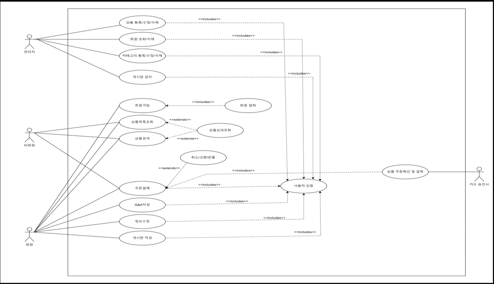
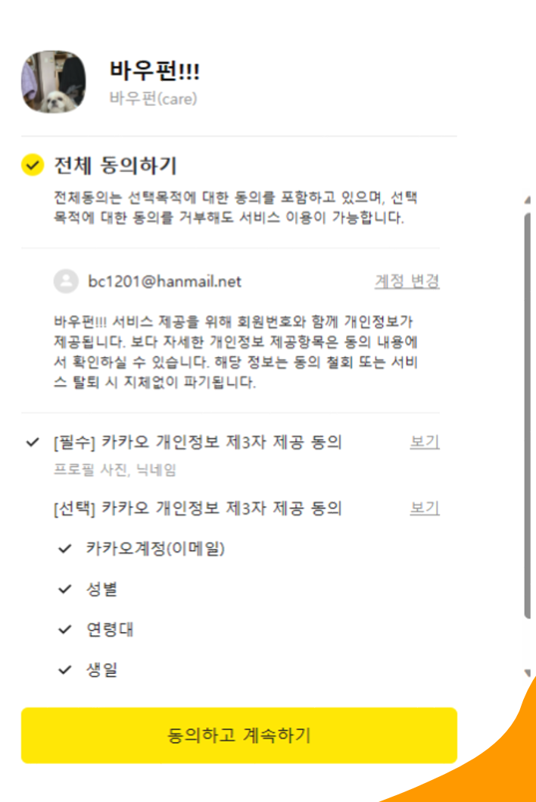
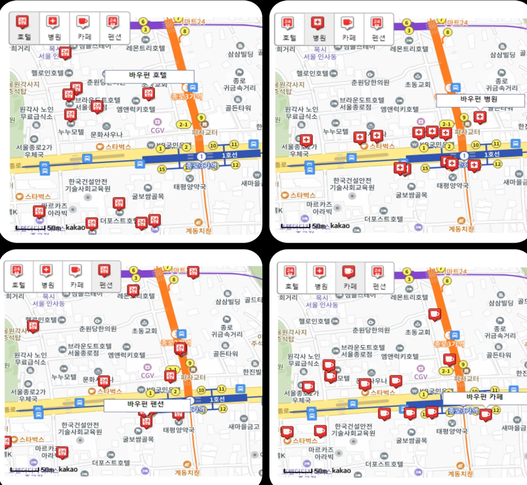
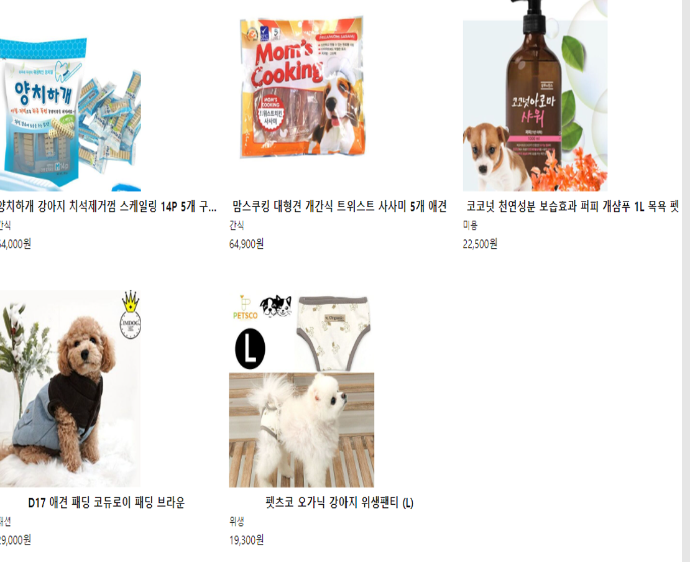
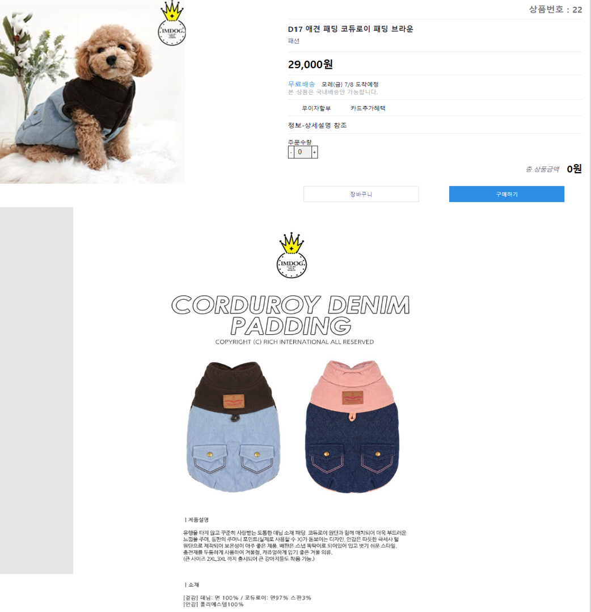
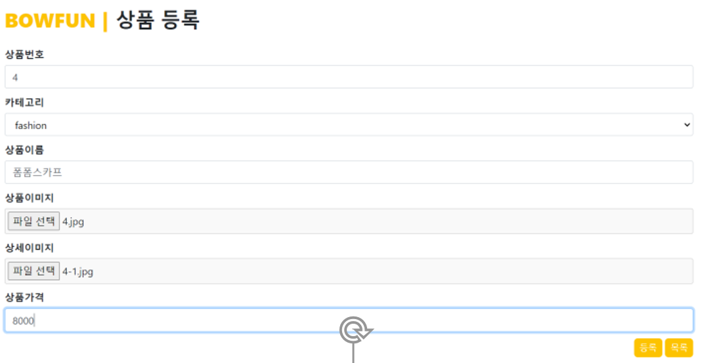
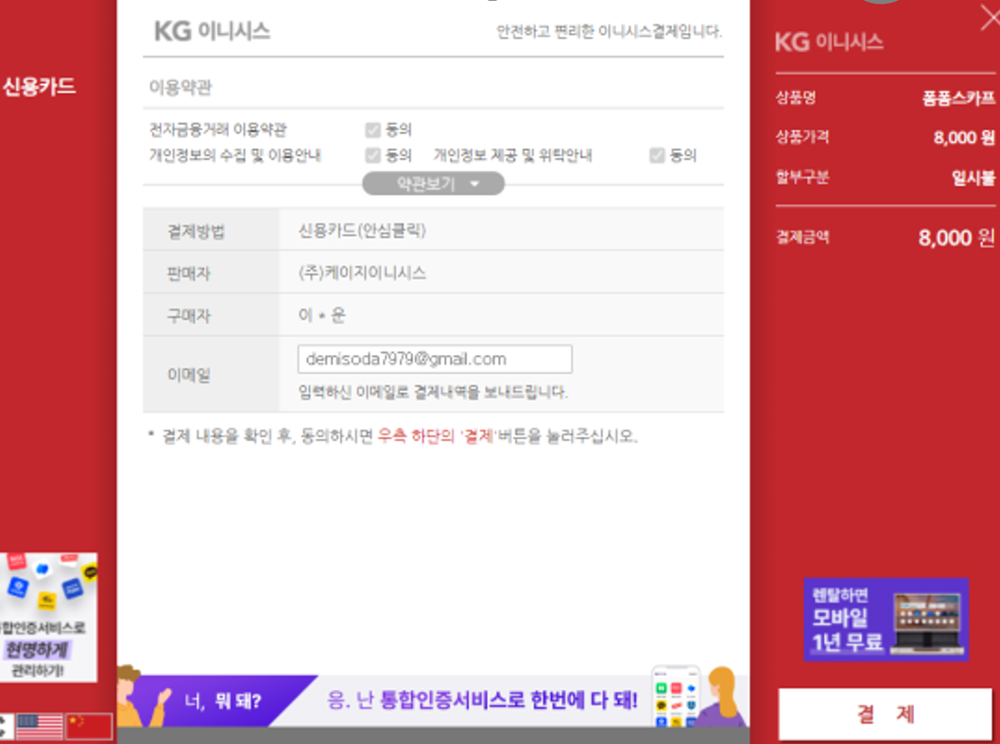
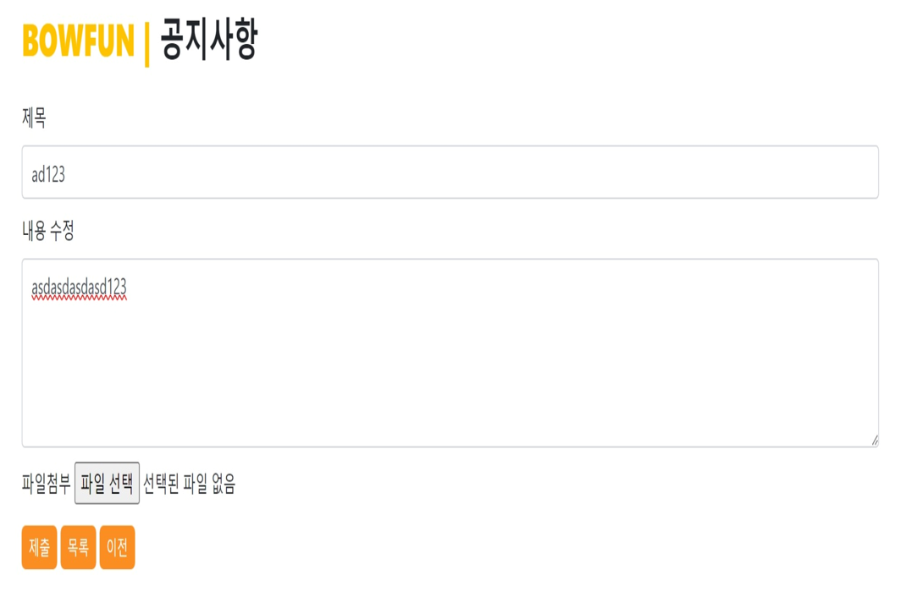
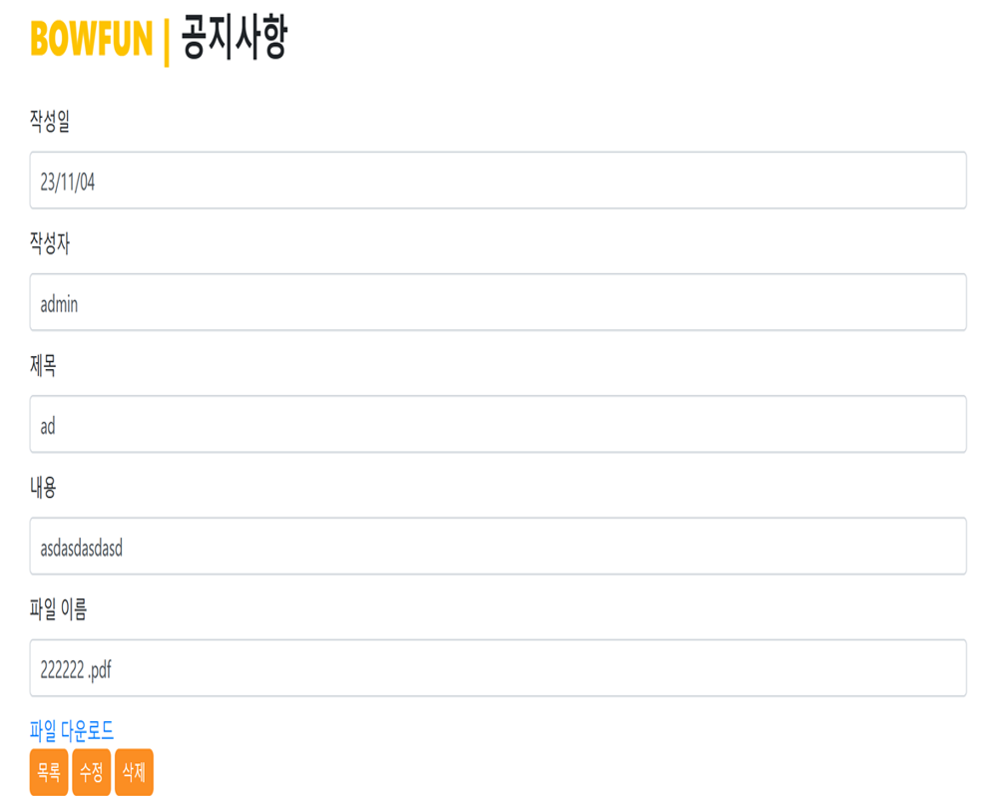

# 🐾 BOWFUN

#### 반려동물 유치원, 병원 위치와 용품을 안전하고 간편한 결제 시스템을 제공하는 종합 쇼핑몰 플랫폼

> 2023.10.12 ~ 2023.11.05

 

---

1. **[웹 서비스 소개](#1-웹-서비스-소개)**
2. **[기술 스택](#2-기술-스택)**
3. **[주요 기능](#3-주요-기능)**
4. **[시스템 아키텍쳐](#4-시스템-아키텍쳐)**
5. **[서비스 화면](#5-서비스-화면)**
6. **[개발 팀 소개](#6-개발-팀-소개)**
   
## 1. 웹 서비스 소개

### ✨ BOWFUN: 반려동물을 위한 통합 쇼핑 & 위치 기반 서비스 플랫폼

반려동물 유치원, 병원, 호텔 정보를 찾고
용품까지 안전하게 구매하고 싶었던 경험, 있으신가요?

BOWFUN은 지도 기반 정보 탐색부터 상품 구매 및 결제까지
반려동물과 함께하는 삶을 더 간편하고 안전하게 만들어드립니다.

#### 🌟 BOWFUN만의 특별함

    - 하나의 플랫폼으로 모두 해결: 병원, 유치원, 호텔 정보 검색부터 용품 쇼핑까지 한번에
    - 지도 기반 서비스: Kakao Map API를 활용하여 주변 서비스를 직관적으로 확인
    - 안전한 결제 시스템: 결제 API와 연동된 신뢰도 높은 쇼핑 환경 제공

#### 💡 이런 분들에게 완벽해요

    - 반려동물 용품과 지역 서비스를 함께 관리하고 싶은 보호자
    - 병원/유치원/호텔 등의 위치와 상세 정보를 한눈에 보고 싶은 사람
    - 간편한 결제 시스템과 통합 쇼핑 경험을 원하는 사용자

 

## 2. 기술 스택
 
### **Backend**

  

### **Database**

 

### **Communication**

 

## 3. 주요 기능

|                기능                | 내용                                                                                                                                                                                                      |
| :--------------------------------: | :-------------------------------------------------------------------------------------------------------------------------------------------------------------------------------------------------------- |
|      **상품 거래 및 결제 시스템**      | 사용자는 반려동물 용품을 선택하고, 장바구니 담기부터 결제까지 한 번에 진행할 수 있습니다. KG이니시스 결제 시스템을 도입하여 신뢰도 높은 안전한 결제가 가능합니다.                              |
|      **게시판 / 공지사항 기능**   | 	사용자 간 정보 공유를 위한 커뮤니티 기능과 운영자가 전달하는 공지사항을 게시할 수 있는 기능을 제공합니다.                         |
|      **병원 / 유치원 / 호텔 / 펜션 위치 확인**         | Kakao Map API를 활용해 주변 반려동물 관련 시설(병원, 유치원, 호텔, 펜션 등)의 위치를 지도에서 직관적으로 확인할 수 있습니다. 
|        **카카오 로그인 / 회원가입**         | 	카카오 OAuth 인증을 이용한 간편 로그인 및 회원가입 기능을 제공하여 사용자 접근성과 편의성을 높였습니다.

 

 

## 4. 시스템 아키텍쳐

 

<a href="#"> 

 

## 5. 서비스 화면

### 로그인 & 회원가입

<table>
  <tr>
    <td align="center">
       
      회원가입 화면
    </td>
  </tr>
</table>

- JWT 기반 인증 시스템 구현
- 카카로 로그인,회원가입 연동동

--- 

### 지도 서비스

### 1. 카카오 MAP 연동
<table>
  <tr>
    <td align="center">
       
      MAP
    </td>
  </tr>
</table>

- 카카오 맵 연동
- 마커 클릭 시 커스텀 오버레이 표시

### 상품 서비스

### 1. 상품 목록
<table>
  <tr>
    <td align="center">
       
      목록
    </td>
  </tr>
</table>

- 상품 CRUD - 목록록

### 2. 상품 상세 페이지

<table>
  <tr>
    <td align="center">
       
      상세페이지지
    </td>
  </tr>
</table>

- 상품 CRUD - 상세 목록

### 3. 상품 등록
<table>
  <tr>
    <td align="center">
       
      등록
    </td>
  </tr>
</table>

- 상품 CRUD - 등록

---
### 결제 서비스

### 1.  결제
<table>
  <tr>
    <td align="center">
       
      MAP
    </td>
  </tr>
</table>

- KG 이너시스 사용
  
---
### 1. 공지사항 등록
<table>
  <tr>
    <td align="center">
       
      공지사랑 등록
    </td>
  </tr>
</table>

- 공지사항 CRUD - 등록

### 2. 공지사항 수정
<table>
  <tr>
    <td align="center">
       
      공지사항 수정
    </td>
  </tr>
</table>

- 공지사항 CRUD - 수정

## 6. 개발 팀 소개

---
<table>
  <tbody>
    <tr>
      <td align="center">
        <a href="#"> 
        <b>FullStack : 팀장 최연지
      </td>
      <td align="center">
        <a href="#"> 
        <b>FullStack : 이동운
      </td>
      <td align="center">
        <a href="#"> 
        <b>FullStack : 전찬범
      </td>
      <td align="center">
        <a href="#"> 
        <b>FullStack : 황지현
      </td>
    </tr>

  </tbody>
</table>

 

## 📝 산출물

---

### 1. [PPT](https://gravel-seagull-322.notion.site/1afef7bc762580fbaa03df1df705095b?pvs=4)

